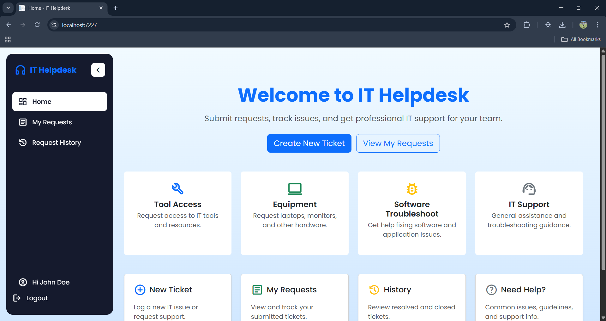
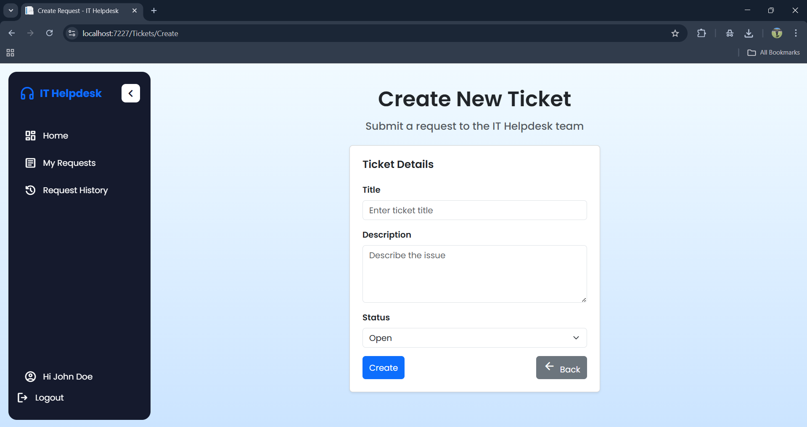
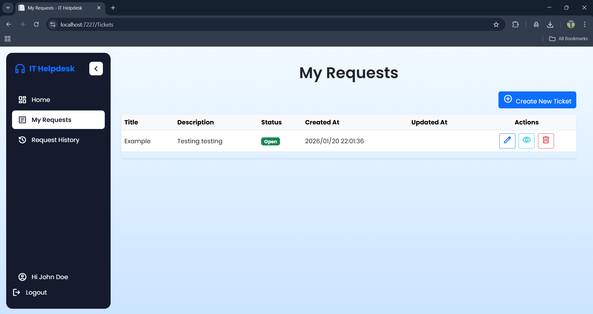

# 🛠️ IT Helpdesk System (ASP.NET Core MVC)

## Project Overview
The **IT Helpdesk System** is a full-stack web application designed to manage IT support tickets within an organization. It enables users to submit and track IT requests while allowing administrators to manage tickets, users, and roles through secure, role-based access.

---

## Author
**Tshwarelo Lephoto**

**Project Type:** Full-Stack Web Application  
**Tech Stack:** ASP.NET Core MVC, Entity Framework Core, SQL Server, C#, Razor Pages, Bootstrap 5  
**Date Started:** April 2025  
**Status:** Partially Completed (January 2026)

---

## Features
- Submit IT support tickets
- Track ticket status (Open / Closed)
- View ticket history
- Role-based access (User / Admin)
- Secure authentication and authorization
- Responsive UI with Bootstrap 5

---

## Technologies Used
- **Backend:** ASP.NET Core MVC
- **Frontend:** Razor Pages, Bootstrap 5, Google Material Symbols
- **Database:** SQL Server
- **ORM:** Entity Framework Core
- **Authentication:** ASP.NET Core Identity
- **Language:** C#
- **IDE:** Visual Studio 2022
- **Version Control:** Git & GitHub

---

## Roles & Permissions

### User
- Create tickets
- View own tickets
- View ticket history

### Admin
- View all tickets
- Close tickets
- Delete tickets
- Manage users and roles (planned)

---

## Database Design

### ApplicationUser (inherits `IdentityUser`)
- `FullName`

### Ticket
- `TicketId`
- `Title`
- `Description`
- `Status`
- `CreatedAt`
- `UpdatedAt`
- `CreatedById`
- `AssignedToId` (optional)

### Relationships
- One ApplicationUser → Many Tickets (CreatedBy)
- One ApplicationUser → Many Tickets (AssignedTo, optional)

---

## Identity & Security
- ASP.NET Core Identity
- Role seeding on application startup
- `[Authorize]` and `[Authorize(Roles = "Admin")]`
- Ownership validation for ticket actions
- Guest access restricted

---

## Controllers

### TicketsController
- User-specific ticket listing
- Admin access to all tickets
- Ticket creation, editing, closing, deletion
- EF Core `Include()` for relational data loading

### AdminController (Planned)
- User and role management
- Admin dashboard
- Admin-only access

---

## User Interface
- Responsive sidebar navigation
- Role-based menu visibility
- Admin badge display
- Dashboard shortcuts
- Bootstrap 5 layout and styling

---

## Routing & Middleware
```csharp
app.UseAuthentication();
app.UseAuthorization();

app.MapControllerRoute(
    name: "default",
    pattern: "{controller=Home}/{action=Index}/{id?}");

app.MapRazorPages();
```
---

## Screenshots

### Dashboard


### Create Ticket


### Ticket List


### Ticket Details


### Ticket History


